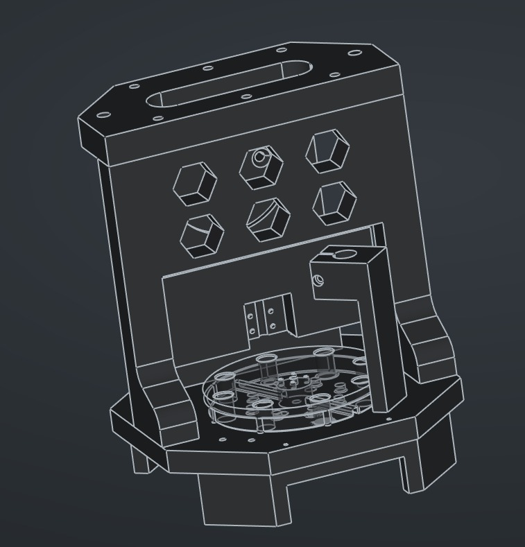

# OpenDecapper




**OpenDecapper** is an open-source, automated hardware solution for decapping fired brass. This project aims to provide a reliable, high-speed alternative to manual decapping by leveraging 3D-printed mechanics and Arduino-based control.

This is a DIY project for educational purposes. Users are responsible for ensuring compliance with local laws and intellectual property.
---

## 📂 Repository Structure

* **/code**: Source code (`.ino`) for the microcontroller. Handles motor control, cycle timing, and sensor feedback.
* **/stl**: STL files for all structural and functional components.

---

## 🛠 Features

* **Automated Cycling:** Continuous feeding and de-priming.
* **Open Hardware:** Fully customizable to fit different bench setups.
* **Adjustable Speed:** Code-based control for different brass conditions.
* **Modular Toolheads:** Quick-swap heads for different calibers.

---

## 🖨️ Print Instructions

For maximum durability and mechanical precision, use the following settings:

| Setting | Value |
| :--- | :--- |
| **Material** | PETG |
| **Infill** | 40% adaptive cubic |
| **Walls** | 8 |
| **Top Layers** | 7 |
| **Bottom Layers** | 7 |

---

## 🚀 Getting Started

### 1. Hardware Requirements
* **Electronics:** Arduino (Nano/Uno), NEMA 17 Stepper Motor, Stepper Driver (TMC2209 or TMC2208).
* **Tools:** 3D Printer (PETG recommended), M3/M5 Bolt kit, 8mm Linear Rails.

### 2. Software Setup
1.  Clone this repository:
    ```bash
    git clone [https://github.com/EggCe/OpenDecapper.git](https://github.com/EggCe/OpenDecapper.git)
    ```
2.  Open `/code/sketch/sketch.ino` in the Arduino IDE.
3.  Install necessary libraries (e.g., `AccelStepper`).
4.  Upload to your board.

---

## 📅 Upcoming Milestones

- [ ] **Comprehensive BOM:** Detailed list of all off-the-shelf parts and fasteners.
- [ ] **Assembly Manual:** Step-by-step instructions with wiring diagrams.
- [ ] **Calibration Guide:** Tips for timing the stroke and sensor alignment.

---

## 🤝 Contributing

Contributions are what make the open-source community such an amazing place to learn, inspire, and create.

---

## ⚖️ License

This project is licensed under the **Creative Commons Attribution-NonCommercial 4.0 International (CC BY-NC 4.0)**. 

**Summary:** You are free to share and adapt this material for non-commercial purposes only. If you remix or build upon this work, you must give appropriate credit. Commercial use of these designs or code is prohibited without explicit permission.

---

**⚠️ SAFETY WARNING:** — READ BEFORE BUILDING OR OPERATING

This machine will crush fingers and hands without breaking a sweat. It is a motorized press driven by a DC motor with significant torque. It does not know or care if something is in the way.

* NEVER run this machine unattended.
* NEVER allow children near the machine, whether it is running or not.
* Keep your hands and fingers away from the machine at ALL times when it is powered on.
* Treat it like any industrial press — it can and will cause serious injury if misused.

LIABILITY DISCLAIMER: This project is provided as-is with absolutely no warranty of any kind. The author(s) accept no responsibility or liability for any injury, damage, or loss resulting from building, modifying, or operating this machine. You build and use it entirely at your own risk.